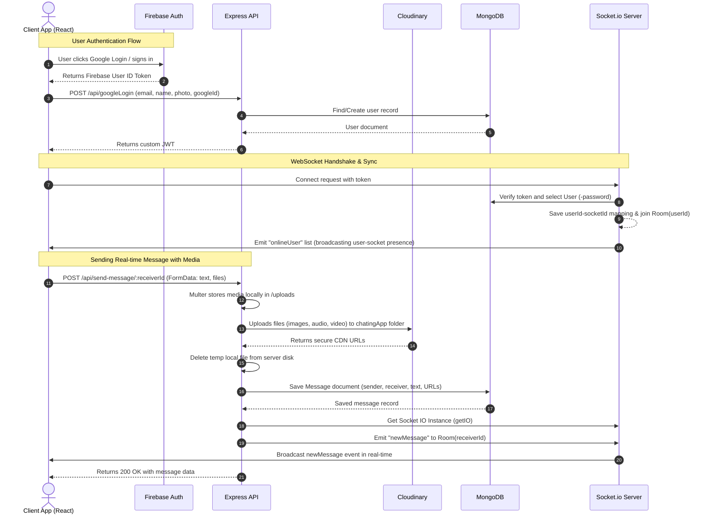

# 💬 Real-Time Chatting Application Architecture & System Documentation

Welcome to the **Real-Time Chatting Application** developer documentation. This document serves as the comprehensive, production-grade system guide explaining the architectural design patterns, components, data flows, folder structures, and deployment requirements of this codebase.

---

## 🗺️ Table of Contents
1. [Project Overview & High-Level Architecture](#1-project-overview--high-level-architecture)
2. [System & Data Flow](#2-system--data-flow)
3. [Directory Structure & Component Mapping](#3-directory-structure--component-mapping)
4. [Per-File Breakdown](#4-per-file-breakdown)
5. [Key Modules & Systems](#5-key-modules--systems)
6. [Setup, Environment, and Deployment](#6-setup-environment-and-deployment)

---

## 1. Project Overview & High-Level Architecture

The Chatting Application is a production-ready, full-stack, real-time messaging platform. It allows registered users to engage in direct chat communication, mock group interactions, view online/offline user presence statuses, update their profile settings (including profile photos), and transmit media files (images, audio, and video) in messages.

### High-Level Architecture
The project is built on a decoupled **Client-Server Architecture**:
- **Client (Frontend)**: A Single Page Application (SPA) built using [React 19](file:///C:/Users/sanka/OneDrive/Desktop/Chatting%20App/client/package.json#L18) and compiled via [Vite](file:///C:/Users/sanka/OneDrive/Desktop/Chatting%20App/client/package.json#L39). It uses [Tailwind CSS v4](file:///C:/Users/sanka/OneDrive/Desktop/Chatting%20App/client/package.json#L25) for high-performance styling, [React Router DOM v7](file:///C:/Users/sanka/OneDrive/Desktop/Chatting%20App/client/package.json#L22) for client-side routing, and the [Socket.IO Client](file:///C:/Users/sanka/OneDrive/Desktop/Chatting%20App/client/package.json#L23) for real-time bi-directional events.
- **Server (Backend)**: An [Express.js](file:///C:/Users/sanka/OneDrive/Desktop/Chatting%20App/server/package.json#L20) Node.js server powered by [Mongoose](file:///C:/Users/sanka/OneDrive/Desktop/Chatting%20App/server/package.json#L22) (MongoDB) for database storage and [Socket.IO](file:///C:/Users/sanka/OneDrive/Desktop/Chatting%20App/server/package.json#L25) for managing connection pools, rooms, and event routing.

```
┌────────────────────────────────────────────────────────┐
│                   Client Application                   │
│  ┌───────────┐  ┌──────────────────┐  ┌─────────────┐  │
│  │ React SPA │  │ Firebase Auth SDK│  │ Socket Client│  │
│  └─────┬─────┘  └────────┬─────────┘  └──────┬──────┘  │
└────────┼─────────────────┼───────────────────┼─────────┘
         │ HTTP Requests   │ Google Popup      │ Real-time Events
         │ (Axios)         │ (OAuth 2.0)       │ (WebSockets)
         ▼                 ▼                   ▼
┌──────────────────────────────────────────────┬─────────┐
│              Backend REST API                │ Socket  │
│  ┌──────────────────┐  ┌──────────────────┐  │ Server  │
│  │ Auth Routes      │  │ Message Routes   │  │ (Port   │
│  ├──────────────────┤  ├──────────────────┤  │  3000)  │
│  │ Auth Controller  │  │ Msg Controller   │  │         │
│  └────────┬─────────┘  └────────┬─────────┘  └───┬─────┘
└───────────┼─────────────────────┼────────────────┼─────┘
            ▼                     ▼                │
┌────────────────────────┐  ┌───────────────────┐  │
│      Cloud Storage     │  │ Database Layer    │  │
│    (Cloudinary CDN)    │  │ (MongoDB Atlas)   │◄─┘ Room Routing
└────────────────────────┘  └───────────────────┘
```

### Overarching Design Patterns
1. **MVC (Model-View-Controller)**: The backend is organized around MVC design. 
   - **Models**: Defines data structures for [User.js](file:///C:/Users/sanka/OneDrive/Desktop/Chatting%20App/server/models/User.js) and [Message.js](file:///C:/Users/sanka/OneDrive/Desktop/Chatting%20App/server/models/Message.js).
   - **Controllers**: Separates business logic from protocols in [auth.controller.js](file:///C:/Users/sanka/OneDrive/Desktop/Chatting%20App/server/controllers/auth.controller.js) and [message.controller.js](file:///C:/Users/sanka/OneDrive/Desktop/Chatting%20App/server/controllers/message.controller.js).
   - **Views**: Separated entirely into the React UI codebase.
2. **Event-Driven Communication**: Real-time operations use WebSockets. Connections register their presence, join specific user-id based rooms, and listen for messages dynamically broadcast by the API controllers.
3. **Stateless Authentication**: HTTP services use bearer-token JWT authorization headers verified per request by the [verifyToken.middleware.js](file:///C:/Users/sanka/OneDrive/Desktop/Chatting%20App/server/middleware/verifyToken.middleware.js). WebSockets mirror this pattern by validating the token during the socket connection handshake via [socket.auth.middleware.js](file:///C:/Users/sanka/OneDrive/Desktop/Chatting%20App/server/middleware/socket.auth.middleware.js).
4. **Pipeline Middleware**: Media processing utilizes a stacked pipeline: HTTP Request ➔ Multer Disk Buffer ➔ Cloudinary CDN Upload ➔ MongoDB Metadata Insertion ➔ Client Broadcast.

---

## 2. System & Data Flow

Below is the step-by-step data lifecycle mapping of how data flows through the application, visualized with a Mermaid sequence diagram.

### Sequence Diagram: Authentication & Real-Time Messaging Lifecycle



### Detailed Flow Descriptions
1. **User Sign Up / Login (Email/Password)**: 
   - A client submits details to `/api/signup` or `/api/login`. 
   - The server hashes the password with `bcryptjs` (cost factor 10) during sign up.
   - On login, it verifies credentials, generates a JWT signed with `JWT_SECRET` expiring in 365 days, and returns it.
2. **Google OAuth Authentication**: 
   - The user triggers Google Login on the client via the Firebase Client SDK.
   - Firebase performs OAuth 2.0 and retrieves user metadata.
   - The client forwards this metadata to `/api/googleLogin`.
   - The server registers the user (without password fields) or updates details, generates a JWT, and sends it back to the client. The client saves this to `localStorage` under `"token"` and `"user"`.
3. **Socket.io Handshake & Sync**:
   - The frontend's [App.jsx](file:///C:/Users/sanka/OneDrive/Desktop/Chatting%20App/client/src/App.jsx) detects the storage token and instantiates `socket.io-client`.
   - The handshake routes to the server's Socket instance, validating the JWT.
   - Upon validation, the backend maps the `socket.id` to the `userId` in `userSocketMap`.
   - The socket joins a room named after the `userId.toString()`.
   - The server broadcasts the updated array of active user IDs to all sockets using the `onlineUser` event.
4. **Direct Message Delivery Pipeline**:
   - The client selects a contact, fetches history from `/api/get-message/:userId`, and listens for new messages.
   - A user types a message and/or attaches media files, sending a request to `/api/send-message/:receiverId`.
   - The server runs the request through the `multer` middleware (buffering to the local `/uploads` folder) and the `uploadToCloudinary` middleware.
   - The media is parsed, sent to Cloudinary, and saved to local arrays (`imageUrl`, `videoUrl`, `audioUrl`), after which the local temporary file is immediately deleted.
   - The server creates a `Message` document in MongoDB.
   - It checks `userSocketMap`. If the recipient has an active socket, the server emits a `newMessage` event specifically targeting the recipient's room.
   - The client receives the event, appends it to its state, and smoothly scrolls to the bottom of the screen.

---

## 3. Directory Structure & Component Mapping

```
Chatting App/
├── .github/                     # GitHub Actions workflows & configurations
├── client/                      # Vite + React Front-end Workspace
│   ├── public/                  # Static assets served directly
│   ├── src/
│   │   ├── api/                 # Endpoint configuration details
│   │   │   └── config.js        # API Base URL wrapper
│   │   ├── assets/              # Standard assets, fonts, icons
│   │   ├── components/          # Reusable UI component blocks
│   │   │   ├── chat/            # Header, Message Area, Input Bar
│   │   │   ├── Contacts.jsx     # Side navbar listing all users & online statuses
│   │   │   ├── GroupTab.jsx     # Side navbar listing channels/groups
│   │   │   ├── MediaModal.jsx   # Image/Video/Audio fullscreen overlay player
│   │   │   ├── WelcomeScreen.jsx# Initial empty state view
│   │   │   └── __tests__/       # Client-side component test suites
│   │   ├── config/              # Configuration files
│   │   │   └── firebase.js      # Client-side Firebase Google Auth Setup
│   │   ├── context/             # Global React Context hooks
│   │   │   ├── SocketContext.jsx# Socket client reference & online users hook
│   │   │   └── ThemeContext.jsx # Light/Dark mode state sync provider
│   │   ├── layouts/             # App structure shells
│   │   │   └── MainLayout.jsx   # Two-column layout (Sidebar & Active Route)
│   │   ├── pages/               # Routed page views
│   │   │   ├── Chat.jsx         # Direct messaging workspace
│   │   │   ├── Group.jsx        # Group messaging workspace
│   │   │   ├── Login.jsx        # Credentials/Google login screen
│   │   │   ├── SignUp.jsx       # Credentials registration screen
│   │   │   ├── Profile.jsx      # Display Name/Email/Avatar updates
│   │   │   └── Settings.jsx     # User settings navigation pane & theme toggler
│   │   ├── App.jsx              # Main routing and Socket connector component
│   │   ├── index.css            # Base styles and Tailwind customization
│   │   ├── main.jsx             # React DOM application mount entry point
│   │   └── setupTests.js        # Vitest setup configurations
│   ├── package.json             # Front-end dependencies & execution scripts
│   └── vite.config.js           # Vite bundler configurations
│
└── server/                      # Node.js + Express Backend Workspace
    ├── config/                  # Cloud database and file service configurations
    │   ├── db.js                # Mongoose MongoDB connection routine
    │   └── cloudinary.js        # Cloudinary SDK credentials setup
    ├── controllers/             # Endpoint implementation logic
    │   ├── auth.controller.js   # User management (signUp, login, profile, contacts)
    │   └── message.controller.js# Messaging operations (sendMessage, getMessage, getUserById)
    ├── middleware/              # Router validation filters
    │   ├── cloudinary.middleware.js # File parser and cloud uploader helper
    │   ├── multer.middleware.js     # Multipart request handler & local storage
    │   ├── socket.auth.middleware.js# Socket connection token authenticator
    │   └── verifyToken.middleware.js# HTTP Express router authorization check
    ├── models/                  # Database schema entities
    │   ├── Message.js           # Message model schema definition
    │   └── User.js              # User profile schema definition
    ├── routes/                  # Route endpoint bindings
    │   ├── auth.route.js        # Authentication and profile API routes
    │   └── message.route.js     # Chat and user queries API routes
    ├── services/                # Backend utilities
    │   └── socket.js            # Socket.io connection manager
    ├── uploads/                 # Temporary local folder for multipart uploads
    ├── seeder.js                # Database seeder (creates 17 sample users)
    └── package.json             # Backend dependencies & npm run scripts
```

---

## 4. Per-File Breakdown

This section details every primary developer file in the codebase.

### 🌐 Backend Files (server/)

- **[server/index.js](file:///C:/Users/sanka/OneDrive/Desktop/Chatting%20App/server/index.js)**  
  *Role:* Entry point of the Node backend. Initializes Express, mounts global middlewares (JSON parser, CORS), registers routes under `/api`, connects Socket.io, and starts listening on the defined port while establishing a connection to MongoDB.  
  *Exports:* None (Executable).  
  *Dependencies:* `express`, `cors`, `dotenv`, [server/config/db.js](file:///C:/Users/sanka/OneDrive/Desktop/Chatting%20App/server/config/db.js), [server/routes/auth.route.js](file:///C:/Users/sanka/OneDrive/Desktop/Chatting%20App/server/routes/auth.route.js), [server/routes/message.route.js](file:///C:/Users/sanka/OneDrive/Desktop/Chatting%20App/server/routes/message.route.js), [server/services/socket.js](file:///C:/Users/sanka/OneDrive/Desktop/Chatting%20App/server/services/socket.js).

- **[server/config/db.js](file:///C:/Users/sanka/OneDrive/Desktop/Chatting%20App/server/config/db.js)**  
  *Role:* Connects the server to MongoDB using Mongoose.  
  *Exports:* `dbConnect` (async connection function).  
  *Dependencies:* `mongoose`, `dotenv`.

- **[server/config/cloudinary.js](file:///C:/Users/sanka/OneDrive/Desktop/Chatting%20App/server/config/cloudinary.js)**  
  *Role:* Configures the Cloudinary v2 SDK using variables from the environment file to prepare it for secure uploads.  
  *Exports:* Configured Cloudinary v2 instance.  
  *Dependencies:* `cloudinary`.

- **[server/models/User.js](file:///C:/Users/sanka/OneDrive/Desktop/Chatting%20App/server/models/User.js)**  
  *Role:* Schema definition for the `User` document. Represents `fullName`, `email` (unique, lowercase), `password` (hashed, optional to support Google OAuth users), `profilePic` (Cloudinary URL string), and `googleId`.  
  *Exports:* User model.  
  *Dependencies:* `mongoose`.

- **[server/models/Message.js](file:///C:/Users/sanka/OneDrive/Desktop/Chatting%20App/server/models/Message.js)**  
  *Role:* Schema definition for the `Message` document. Represents `senderId` (ref `User`), `receiverId` (ref `User`), text, and lists of `imageUrl`, `videoUrl`, and `audioUrl` files. Includes automatic timestamps.  
  *Exports:* Message model.  
  *Dependencies:* `mongoose`.

- **[server/middleware/verifyToken.middleware.js](file:///C:/Users/sanka/OneDrive/Desktop/Chatting%20App/server/middleware/verifyToken.middleware.js)**  
  *Role:* Express middleware that verifies incoming JWTs. It extracts the token from the HTTP `Authorization` header, decodes it, selects the user from the database (excluding password fields), and attaches the user object to `req.user`.  
  *Exports:* `verifyToken` middleware.  
  *Dependencies:* `jsonwebtoken`, [server/models/User.js](file:///C:/Users/sanka/OneDrive/Desktop/Chatting%20App/server/models/User.js).

- **[server/middleware/socket.auth.middleware.js](file:///C:/Users/sanka/OneDrive/Desktop/Chatting%20App/server/middleware/socket.auth.middleware.js)**  
  *Role:* Middleware for Socket.io. Validates JWTs sent during the socket handshake (in headers or authentication parameters) before accepting connection events.  
  *Exports:* `socketAuth` middleware.  
  *Dependencies:* `jsonwebtoken`, [server/models/User.js](file:///C:/Users/sanka/OneDrive/Desktop/Chatting%20App/server/models/User.js).

- **[server/middleware/multer.middleware.js](file:///C:/Users/sanka/OneDrive/Desktop/Chatting%20App/server/middleware/multer.middleware.js)**  
  *Role:* Handlers for incoming multi-part form data. Configures disk storage in the local folder `server/uploads/` with a maximum file size limit of 100MB.  
  *Exports:* Multer instance helper `upload`.  
  *Dependencies:* `multer`, `fs`.

- **[server/middleware/cloudinary.middleware.js](file:///C:/Users/sanka/OneDrive/Desktop/Chatting%20App/server/middleware/cloudinary.middleware.js)**  
  *Role:* Middleware to upload buffered local files from Multer to Cloudinary. It automatically handles large files over 10MB using Cloudinary's chunked `upload_large` API. Once uploaded, it places URLs in the request object (`req.imageUrl`, `req.videoUrl`, `req.audioUrl`) and deletes the temporary files from disk.  
  *Exports:* `uploadToCloudinary` middleware.  
  *Dependencies:* `fs`, [server/config/cloudinary.js](file:///C:/Users/sanka/OneDrive/Desktop/Chatting%20App/server/config/cloudinary.js).

- **[server/controllers/auth.controller.js](file:///C:/Users/sanka/OneDrive/Desktop/Chatting%20App/server/controllers/auth.controller.js)**  
  *Role:* Implements authentication endpoints: `signUp` (hashes password, registers user), `login` (validates password, signs JWT), `googleLogin` (authenticates Google users, signs JWT), `getProfile` (returns current user), `updateProfile` (saves name, email, or avatar), and `getAllContacts` (lists other users).  
  *Exports:* Controller route handlers.  
  *Dependencies:* `bcryptjs`, `jsonwebtoken`, [server/models/User.js](file:///C:/Users/sanka/OneDrive/Desktop/Chatting%20App/server/models/User.js).

- **[server/controllers/message.controller.js](file:///C:/Users/sanka/OneDrive/Desktop/Chatting%20App/server/controllers/message.controller.js)**  
  *Role:* Implements messaging routes: `getUserById` (gets profile information for header), `sendMessage` (creates message records and broadcasts real-time socket events), and `getMessage` (returns history between two users).  
  *Exports:* Controller route handlers.  
  *Dependencies:* [server/models/Message.js](file:///C:/Users/sanka/OneDrive/Desktop/Chatting%20App/server/models/Message.js), [server/models/User.js](file:///C:/Users/sanka/OneDrive/Desktop/Chatting%20App/server/models/User.js), [server/services/socket.js](file:///C:/Users/sanka/OneDrive/Desktop/Chatting%20App/server/services/socket.js).

- **[server/services/socket.js](file:///C:/Users/sanka/OneDrive/Desktop/Chatting%20App/server/services/socket.js)**  
  *Role:* Connects and manages the socket.io listener. Tracks active user-to-socket ID mappings in `userSocketMap`, runs verification middleware, assigns users to personal rooms, and broadcasts updated lists of online users.  
  *Exports:* `initSocket`, `getIO` (getter function for emitting from controllers).  
  *Dependencies:* `socket.io`, [server/middleware/socket.auth.middleware.js](file:///C:/Users/sanka/OneDrive/Desktop/Chatting%20App/server/middleware/socket.auth.middleware.js).

- **[server/seeder.js](file:///C:/Users/sanka/OneDrive/Desktop/Chatting%20App/server/seeder.js)**  
  *Role:* A utility script to seed database instances with 17 mockup contacts (such as Liam Carter, Ava Sinclair) to simplify layout testing.  
  *Exports:* None (Standalone CLI utility).  
  *Dependencies:* `mongoose`, `bcryptjs`, `dotenv`, [server/models/User.js](file:///C:/Users/sanka/OneDrive/Desktop/Chatting%20App/server/models/User.js).

---

### 💻 Frontend Files (client/)

- **[client/src/main.jsx](file:///C:/Users/sanka/OneDrive/Desktop/Chatting%20App/client/src/main.jsx)**  
  *Role:* Root mounting entry point that wraps components in `<StrictMode>` and mounts `<App />` inside the DOM container.  
  *Exports:* None.  
  *Dependencies:* `react`, `react-dom`, [client/src/App.jsx](file:///C:/Users/sanka/OneDrive/Desktop/Chatting%20App/client/src/App.jsx), [client/src/index.css](file:///C:/Users/sanka/OneDrive/Desktop/Chatting%20App/client/src/index.css).

- **[client/src/App.jsx](file:///C:/Users/sanka/OneDrive/Desktop/Chatting%20App/client/src/App.jsx)**  
  *Role:* Main router and core container for the client. Declares routing configurations (including private, authenticated route blocks), establishes connection pools to the backend Socket server, monitors user presence changes, and mounts global providers.  
  *Exports:* App component.  
  *Dependencies:* `react`, `react-router-dom`, `socket.io-client`, [client/src/context/SocketContext.jsx](file:///C:/Users/sanka/OneDrive/Desktop/Chatting%20App/client/src/context/SocketContext.jsx), [client/src/context/ThemeContext.jsx](file:///C:/Users/sanka/OneDrive/Desktop/Chatting%20App/client/src/context/ThemeContext.jsx), [client/src/layouts/MainLayout.jsx](file:///C:/Users/sanka/OneDrive/Desktop/Chatting%20App/client/src/layouts/MainLayout.jsx), [client/src/pages/Login.jsx](file:///C:/Users/sanka/OneDrive/Desktop/Chatting%20App/client/src/pages/Login.jsx), [client/src/pages/SignUp.jsx](file:///C:/Users/sanka/OneDrive/Desktop/Chatting%20App/client/src/pages/SignUp.jsx).

- **[client/src/api/config.js](file:///C:/Users/sanka/OneDrive/Desktop/Chatting%20App/client/src/api/config.js)**  
  *Role:* Exposes environment configuration constants like the backend URL.  
  *Exports:* `API_BASE_URL`.  
  *Dependencies:* None.

- **[client/src/config/firebase.js](file:///C:/Users/sanka/OneDrive/Desktop/Chatting%20App/client/src/config/firebase.js)**  
  *Role:* Initializes client-side Firebase components. If variables are available, it loads Google Authentication providers and exposes a standard trigger helper.  
  *Exports:* `signInWithGoogle` (async helper).  
  *Dependencies:* `firebase`.

- **[client/src/context/SocketContext.jsx](file:///C:/Users/sanka/OneDrive/Desktop/Chatting%20App/client/src/context/SocketContext.jsx)**  
  *Role:* Context hook that provides access to the active socket server reference, connection state, and the array of currently online users to child elements.  
  *Exports:* `SocketContext`, `useSocket`.  
  *Dependencies:* `react`.

- **[client/src/context/ThemeContext.jsx](file:///C:/Users/sanka/OneDrive/Desktop/Chatting%20App/client/src/context/ThemeContext.jsx)**  
  *Role:* Context hook that handles theme state (light/dark mode). Dynamically applies class toggles to document roots to trigger Tailwind variants and saves settings to local storage.  
  *Exports:* `ThemeProvider`, `useTheme`.  
  *Dependencies:* `react`.

- **[client/src/layouts/MainLayout.jsx](file:///C:/Users/sanka/OneDrive/Desktop/Chatting%20App/client/src/layouts/MainLayout.jsx)**  
  *Role:* Layout shell for the authenticated workspace. Renders a responsive double-pane window: a sidebar showing contacts or group lists, and a main frame containing route sub-pages. Handles mobile layouts by toggling visibility based on path values.  
  *Exports:* MainLayout component.  
  *Dependencies:* `react`, `react-router-dom`, `axios`, [client/src/components/Contacts.jsx](file:///C:/Users/sanka/OneDrive/Desktop/Chatting%20App/client/src/components/Contacts.jsx), [client/src/components/GroupTab.jsx](file:///C:/Users/sanka/OneDrive/Desktop/Chatting%20App/client/src/components/GroupTab.jsx).

- **[client/src/pages/Chat.jsx](file:///C:/Users/sanka/OneDrive/Desktop/Chatting%20App/client/src/pages/Chat.jsx)**  
  *Role:* Standard view page containing the active conversation window. Orchestrates message data states across sub-components.  
  *Exports:* Chat component.  
  *Dependencies:* [client/src/components/chat/ChatHeader.jsx](file:///C:/Users/sanka/OneDrive/Desktop/Chatting%20App/client/src/components/chat/ChatHeader.jsx), [client/src/components/chat/MessageArea.jsx](file:///C:/Users/sanka/OneDrive/Desktop/Chatting%20App/client/src/components/chat/MessageArea.jsx), [client/src/components/chat/InputBar.jsx](file:///C:/Users/sanka/OneDrive/Desktop/Chatting%20App/client/src/components/chat/InputBar.jsx).

- **[client/src/pages/Login.jsx](file:///C:/Users/sanka/OneDrive/Desktop/Chatting%20App/client/src/pages/Login.jsx)** & **[client/src/pages/SignUp.jsx](file:///C:/Users/sanka/OneDrive/Desktop/Chatting%20App/client/src/pages/SignUp.jsx)**  
  *Role:* Login and registration pages. Standard inputs are handled via state, validating inputs before calling backend services. Features Google Sign-in OAuth flow integration.  
  *Exports:* Page components.  
  *Dependencies:* `react`, `axios`, `react-router-dom`, `sonner`, [client/src/config/firebase.js](file:///C:/Users/sanka/OneDrive/Desktop/Chatting%20App/client/src/config/firebase.js).

- **[client/src/pages/Settings.jsx](file:///C:/Users/sanka/OneDrive/Desktop/Chatting%20App/client/src/pages/Settings.jsx)**  
  *Role:* Double-pane user settings page. Renders sidebar selectors for profile data editing and appearance options (Light/Dark cards). Handles user sign-out.  
  *Exports:* Settings page.  
  *Dependencies:* `react`, `react-router-dom`, `axios`, [client/src/context/ThemeContext.jsx](file:///C:/Users/sanka/OneDrive/Desktop/Chatting%20App/client/src/context/ThemeContext.jsx), [client/src/pages/Profile.jsx](file:///C:/Users/sanka/OneDrive/Desktop/Chatting%20App/client/src/pages/Profile.jsx).

- **[client/src/pages/Profile.jsx](file:///C:/Users/sanka/OneDrive/Desktop/Chatting%20App/client/src/pages/Profile.jsx)**  
  *Role:* Component in settings panel. Implements profile changes: fullName text, email values, and avatar image uploads (triggering Multer + Cloudinary middleware updates on the server).  
  *Exports:* Profile edit tab.  
  *Dependencies:* `react`, `axios`, `sonner`.

- **[client/src/components/Contacts.jsx](file:///C:/Users/sanka/OneDrive/Desktop/Chatting%20App/client/src/components/Contacts.jsx)**  
  *Role:* Renders a vertical list of registered application users. Matches user IDs against active array lists from socket connections to render "Online" (green) or "Offline" indicators.  
  *Exports:* Contacts panel.  
  *Dependencies:* `react`, `axios`, `react-router-dom`, [client/src/context/SocketContext.jsx](file:///C:/Users/sanka/OneDrive/Desktop/Chatting%20App/client/src/context/SocketContext.jsx).

- **[client/src/components/chat/ChatHeader.jsx](file:///C:/Users/sanka/OneDrive/Desktop/Chatting%20App/client/src/components/chat/ChatHeader.jsx)**  
  *Role:* Renders the top bar of the chat area, displaying the active contact's name, profile image, and online/offline status. Includes a back button for mobile viewports.  
  *Exports:* ChatHeader component.  
  *Dependencies:* `react`, `axios`, `react-router-dom`, [client/src/context/SocketContext.jsx](file:///C:/Users/sanka/OneDrive/Desktop/Chatting%20App/client/src/context/SocketContext.jsx).

- **[client/src/components/chat/MessageArea.jsx](file:///C:/Users/sanka/OneDrive/Desktop/Chatting%20App/client/src/components/chat/MessageArea.jsx)**  
  *Role:* Main scrollable feed showing active chat bubbles. Differentiates layout depending on the sender (Me: blue, Right; Contact: gray, Left). Renders text paragraphs, image grids, custom video layouts, and voice message cards. Subscribes to backend `newMessage` events to append chats in real time.  
  *Exports:* MessageArea feed.  
  *Dependencies:* `react`, `axios`, `react-router-dom`, `react-icons`, [client/src/context/SocketContext.jsx](file:///C:/Users/sanka/OneDrive/Desktop/Chatting%20App/client/src/context/SocketContext.jsx), [client/src/components/MediaModal.jsx](file:///C:/Users/sanka/OneDrive/Desktop/Chatting%20App/client/src/components/MediaModal.jsx).

- **[client/src/components/chat/InputBar.jsx](file:///C:/Users/sanka/OneDrive/Desktop/Chatting%20App/client/src/components/chat/InputBar.jsx)**  
  *Role:* Interactive chat bar. Handles text input (sending on Enter key), registers image, video, or audio uploads, shows thumbnails of pending files, packages data into a multipart FormData request, and calls the API.  
  *Exports:* InputBar container.  
  *Dependencies:* `react`, `axios`, `react-router-dom`, `sonner`, `react-icons`, [client/src/context/SocketContext.jsx](file:///C:/Users/sanka/OneDrive/Desktop/Chatting%20App/client/src/context/SocketContext.jsx).

- **[client/src/components/MediaModal.jsx](file:///C:/Users/sanka/OneDrive/Desktop/Chatting%20App/client/src/components/MediaModal.jsx)**  
  *Role:* Fullscreen modal overlay to play videos, zoom images, or play audio clips without exiting the active screen context.  
  *Exports:* MediaModal portal.  
  *Dependencies:* `react`.

---

## 5. Key Modules & Systems

This section dives into the three core subsystems that power the chatting application.

### A. Authentication & Security System
The system implements a stateless validation pipeline utilizing JSON Web Tokens (JWT) combined with credentials or Google OAuth authentication.

```
Credential Sign Up / Sign In ────┐
                                 ├─► User validation ─► Generate JWT (payload: userId)
Google OAuth Sign In (Firebase) ─┘
                                                       │
   WebSocket Handshake/Express HTTP Request ◄──────────┘
   │
   ├── verifyToken.middleware.js ──► Check Auth Header: "Bearer [Token]" ──► Decode ──► Find User ──► req.user
   └── socket.auth.middleware.js ──► Check socket.handshake token       ──► Decode ──► Find User ──► socket.user
```

1. **Bcrypt Password Protection**: When creating an account through [SignUp.jsx](file:///C:/Users/sanka/OneDrive/Desktop/Chatting%20App/client/src/pages/SignUp.jsx), the password is sent to the server. The [auth.controller.js](file:///C:/Users/sanka/OneDrive/Desktop/Chatting%20App/server/controllers/auth.controller.js#L23) hashes the password before saving to prevent raw credentials exposure:
   ```javascript
   const hashedPassword = await bcrypt.hash(password, 10);
   ```
2. **Two-Tier Authentication Middlewares**: 
   - **REST APIs**: Paths such as `/api/getProfile` or `/api/send-message/:receiverId` are protected by `verifyToken`.
   - **Real-Time Connections**: Socket connections run through `socketAuth` middleware. If a token is not provided or fails validation, the handshake is rejected, preventing unauthorized access.

---

### B. Real-Time WebSocket Orchestration
The real-time synchronization system is managed in [server/services/socket.js](file:///C:/Users/sanka/OneDrive/Desktop/Chatting%20App/server/services/socket.js).

```
                     ┌──────────────────┐
                     │  userSocketMap   │
                     │  (State Store)   │
                     └────────┬─────────┘
                              │
               User Joins     │     User Disconnects
         ┌────────────────────┴────────────────────┐
         ▼                                         ▼
Add userId -> socket.id                     Delete userId
socket.join(userId)                         Broadcast updated array
Broadcast updated array                     to 'onlineUser' event
to 'onlineUser' event
```

1. **Active Mapping & Presence**: When client connections are verified, their socket IDs are stored in the memory object `userSocketMap`:
   ```javascript
   const userId = socket.userId;
   userSocketMap[userId] = socket.id;
   ```
   This is used to determine a user's online/offline status. When the connection closes, the entry is deleted and the updated online list is broadcast to all active clients.
2. **Targeted Message Delivery (Rooms)**: Rather than scanning the socket mapping array every time a message is sent, the server assigns each socket to a room named after their unique `userId` string:
   ```javascript
   socket.join(userId.toString());
   ```
   When a message is saved, the controller obtains the active server instance and sends the payload to that specific room:
   ```javascript
   let io = getIO();
   io.to(receiverId.toString()).emit("newMessage", newMessage);
   ```

---

### C. Media Storage Pipeline
Uploading audio, video, or image files utilizes a structured streaming and upload process.

```
Client Input (files) 
   │
   ▼
FormData Payload (POST /api/send-message/:receiverId)
   │
   ▼
[Multer Disk Buffering] ──► Cached locally in server/uploads/
   │
   ▼
[Cloudinary Middleware] 
   │
   ├── If > 10MB  ──► cloudinary.uploader.upload_large()
   └── If <= 10MB ──► cloudinary.uploader.upload()
   │
   ├── Push secure CDN URL -> req.imageUrl, req.videoUrl, req.audioUrl
   └── Cleanup: fs.unlinkSync() deletes local cache from server disk
   │
   ▼
[Message Controller] ──► Saves CDN links to Message Document in MongoDB
```

1. **Local Buffering**: Files are uploaded to the backend server as multipart form-data. [multer.middleware.js](file:///C:/Users/sanka/OneDrive/Desktop/Chatting%20App/server/middleware/multer.middleware.js) intercepts the payload and caches it in the server's local `/uploads` directory using a unique timestamp naming convention to prevent naming collisions.
2. **CDN Streaming & Upload Chunking**: The server passes files to [cloudinary.middleware.js](file:///C:/Users/sanka/OneDrive/Desktop/Chatting%20App/server/middleware/cloudinary.middleware.js). Because video or audio clips can exceed standard free-tier payload limits (10MB), files are inspected and handled accordingly:
   - **Small files (≤10MB)** use `cloudinary.uploader.upload`.
   - **Large files (>10MB)** use `cloudinary.uploader.upload_large` to upload files in chunks.
3. **Local Disk Cleanup**: To prevent disk space issues, the middleware cleans up the temporary files from the server's local disk immediately after uploading:
   ```javascript
   finally {
       if (fs.existsSync(file.path)) {
           fs.unlinkSync(file.path);
       }
   }
   ```
4. **Metadata Insertion**: The resulting Cloudinary secure CDN URL is added to the MongoDB document, allowing clients to load and render the media directly from the CDN.

---

## 6. Setup, Environment, and Deployment

This section details how to configure and run the application locally or in production.

### Environment Configurations (.env)

The application uses environment files in both workspace directories to store credentials and configure endpoints.

#### Backend Configuration: [server/.env](file:///C:/Users/sanka/OneDrive/Desktop/Chatting%20App/server/.env)
```env
PORT=3000                                 # HTTP and Socket server port
MONGO_URI=mongodb://localhost:27017/chatApp # MongoDB connection URL
JWT_SECRET=your_jwt_secret_key            # Secret key used to sign JWTs
CLOUDINARY_CLOUD_NAME=your_cloud_name     # Cloudinary identifier
CLOUDINARY_API_KEY=your_cloudinary_key    # Cloudinary API key
CLOUDINARY_API_SECRET=your_api_secret     # Cloudinary secret key
```

#### Frontend Configuration: [client/.env](file:///C:/Users/sanka/OneDrive/Desktop/Chatting%20App/client/.env)
```env
VITE_BASE_URL=http://localhost:3000       # Target URL for API and socket routes
VITE_FIREBASE_API_KEY=your_key            # Firebase API Key
VITE_FIREBASE_AUTH_DOMAIN=domain.com      # Firebase Auth Domain
VITE_FIREBASE_PROJECT_ID=project_id       # Firebase Project ID
VITE_FIREBASE_STORAGE_BUCKET=bucket_url   # Firebase Storage bucket
VITE_FIREBASE_MESSAGING_SENDER_ID=sender_id # Firebase messaging ID
VITE_FIREBASE_APP_ID=app_id               # Firebase app ID
VITE_FIREBASE_MEASUREMENT_ID=measure_id   # Firebase metrics ID
```

---

### Local Installation & Startup

Follow these steps to run the application locally.

#### Step 1: Clone and install backend dependencies
```bash
cd server
npm install
```

#### Step 2: Seed Mock Contacts (Optional)
To test the layout with pre-configured mock users (password defaults to `123456`), run:
```bash
node seeder.js
```

#### Step 3: Run the Backend Server
- **Development Mode** (uses Nodemon live reload):
  ```bash
  npm run dev
  ```
- **Production Mode**:
  ```bash
  npm start
  ```

#### Step 4: Clone and install frontend dependencies
```bash
cd ../client
npm install
```

#### Step 5: Run the Frontend Application
```bash
npm run dev
```
Open [http://localhost:5173](http://localhost:5173) in your browser to view the application.

---

### Security Recommendations for Production
1. **CORS Validation**: Replace wildcard access rules (`origin: "*"`) in both [server/index.js](file:///C:/Users/sanka/OneDrive/Desktop/Chatting%20App/server/index.js) and [server/services/socket.js](file:///C:/Users/sanka/OneDrive/Desktop/Chatting%20App/server/services/socket.js) with specific frontend domains.
2. **Production Database**: Point `MONGO_URI` to a secure MongoDB Atlas replica set rather than a local instance.
3. **Cookie Tokens**: Transition token storage from local storage to signed HTTP-only secure cookies to prevent cross-site scripting (XSS) token theft.
