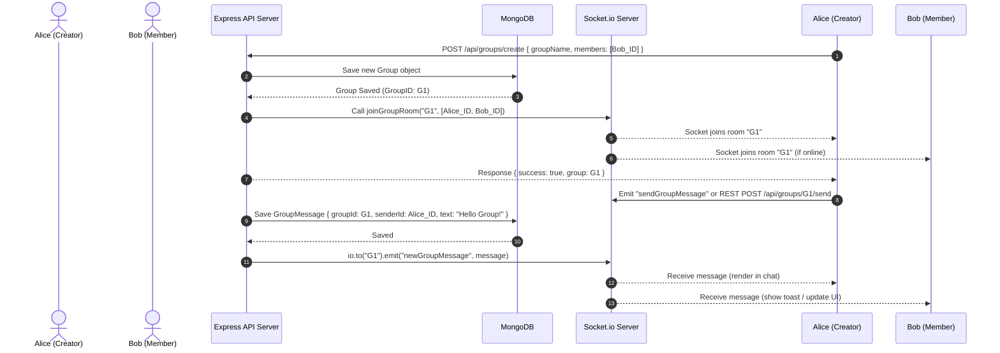

# 👥 Group Chat Implementation Guide

This document provides a highly detailed, step-by-step technical guide for implementing real-time Group Chat functionality in the Chat Application. It covers the database design, socket room architecture, backend routing, and React components.

---

## 1. Architectural Flow Diagram

The diagram below illustrates the flow of events from creating a group to broadcasting a real-time message to all active members of the group.



---

## 2. Database Schema Design (Mongoose)

We will introduce two schemas under `server/models/`:

### A. The Group Schema (`server/models/Group.js`)
This schema tracks metadata for the group, the admin/creator, and the list of members.

```javascript
const mongoose = require("mongoose");

const groupSchema = new mongoose.Schema(
  {
    groupName: {
      type: String,
      required: [true, "Group name is required"],
      trim: true,
      maxlength: [50, "Group name cannot exceed 50 characters"]
    },
    description: {
      type: String,
      trim: true,
      default: ""
    },
    groupPic: {
      type: String,
      default: ""
    },
    admin: {
      type: mongoose.Schema.Types.ObjectId,
      ref: "User",
      required: true
    },
    members: [
      {
        type: mongoose.Schema.Types.ObjectId,
        ref: "User"
      }
    ]
  },
  { timestamps: true }
);

module.exports = mongoose.model("Group", groupSchema);
```

### B. The Group Message Schema (`server/models/GroupMessage.js`)
This schema represents individual messages sent within a group. It references the `Group` model instead of a single `receiverId`.

```javascript
const mongoose = require("mongoose");

const groupMessageSchema = new mongoose.Schema(
  {
    groupId: {
      type: mongoose.Schema.Types.ObjectId,
      ref: "Group",
      required: true,
      index: true // Indexed for fast queries
    },
    senderId: {
      type: mongoose.Schema.Types.ObjectId,
      ref: "User",
      required: true
    },
    text: {
      type: String,
      default: ""
    },
    imageUrl: [{
      type: String
    }],
    videoUrl: [{
      type: String
    }],
    audioUrl: [{
      type: String
    }]
  },
  { timestamps: true }
);

module.exports = mongoose.model("GroupMessage", groupMessageSchema);
```

---

## 3. Real-Time Socket.io Room Setup (Backend)

We configure Socket.io to group connections using **Rooms**. Each group chat will correspond to a Socket.io room named after the group's `_id`.

Modify `server/services/socket.js` to add:

```javascript
const Group = require("../models/Group");

// Helper map to track active user socket connections
const userSocketMap = {}; 

const initSocket = async (server) => {
    io = new Server(server, {
        cors: { origin: "*" }
    });
    io.use(socketAuth);

    io.on("connection", async (socket) => {
        const userId = socket.userId;
        userSocketMap[userId] = socket.id;

        // 1. Join user's individual room for direct messages
        socket.join(userId.toString());

        // 2. Fetch and join all group rooms the user belongs to
        try {
            const userGroups = await Group.find({ members: userId });
            userGroups.forEach((group) => {
                const roomName = group._id.toString();
                socket.join(roomName);
                console.log(`User ${socket.user.fullName} joined room: ${roomName}`);
            });
        } catch (err) {
            console.error("Error joining group rooms:", err);
        }

        socket.on("disconnect", () => {
            delete userSocketMap[userId];
        });
    });
    return io;
};

/**
 * Expose helper to dynamically add active connections to a group room
 * (Used when a new group is created)
 */
const joinGroupRoom = (groupId, memberIds) => {
    memberIds.forEach((memberId) => {
        const socketId = userSocketMap[memberId];
        if (socketId) {
            const socketInstance = io.sockets.sockets.get(socketId);
            if (socketInstance) {
                socketInstance.join(groupId.toString());
                console.log(`Socket ${socketId} dynamically joined new group: ${groupId}`);
            }
        }
    });
};

module.exports = { initSocket, getIO, joinGroupRoom };
```

---

## 4. Backend Endpoints (Controllers & Routes)

### A. Group Controller (`server/controllers/group.controller.js`)

We define the core endpoints for handling group creation, messaging, and query operations.

```javascript
const Group = require("../models/Group");
const GroupMessage = require("../models/GroupMessage");
const { getIO, joinGroupRoom } = require("../services/socket");

// 1. Create a New Group
const createGroup = async (req, res) => {
  try {
    const { groupName, description, members } = req.body;
    const adminId = req.user._id;

    // Ensure all member lists contain the admin/creator
    const uniqueMembers = Array.from(new Set([...members, adminId.toString()]));

    const group = await Group.create({
      groupName,
      description,
      admin: adminId,
      members: uniqueMembers
    });

    // Make online group members join the socket.io room immediately
    joinGroupRoom(group._id, uniqueMembers);

    res.status(201).json({
      success: true,
      message: "Group created successfully",
      group
    });
  } catch (error) {
    res.status(500).json({ success: false, message: error.message });
  }
};

// 2. Get All Groups Joined by Logged In User
const getUserGroups = async (req, res) => {
  try {
    const userId = req.user._id;
    const groups = await Group.find({ members: userId })
      .populate("admin", "fullName email profilePic")
      .populate("members", "fullName email profilePic")
      .sort({ updatedAt: -1 });

    res.status(200).json({ success: true, groups });
  } catch (error) {
    res.status(500).json({ success: false, message: error.message });
  }
};

// 3. Send Message to a Group
const sendGroupMessage = async (req, res) => {
  try {
    const { text } = req.body;
    const { groupId } = req.params;
    const senderId = req.user._id;

    // Verify user is a member of the group
    const group = await Group.findOne({ _id: groupId, members: senderId });
    if (!group) {
      return res.status(403).json({ success: false, message: "Not authorized in this group" });
    }

    const newMessage = await GroupMessage.create({
      groupId,
      senderId,
      text: text || "",
      imageUrl: req.imageUrl || [],
      videoUrl: req.videoUrl || [],
      audioUrl: req.audioUrl || []
    });

    // Populate sender details for UI presentation
    const populatedMessage = await newMessage.populate("senderId", "fullName profilePic");

    // Broadcast to everyone in the socket room
    const io = getIO();
    io.to(groupId.toString()).emit("newGroupMessage", populatedMessage);

    res.status(200).json({
      success: true,
      message: "Group message sent",
      data: populatedMessage
    });
  } catch (error) {
    res.status(500).json({ success: false, message: error.message });
  }
};

// 4. Retrieve Group Messages History
const getGroupMessages = async (req, res) => {
  try {
    const { groupId } = req.params;
    const userId = req.user._id;

    // Verify membership
    const group = await Group.findOne({ _id: groupId, members: userId });
    if (!group) {
      return res.status(403).json({ success: false, message: "Unauthorized group access" });
    }

    const messages = await GroupMessage.find({ groupId })
      .populate("senderId", "fullName profilePic")
      .sort({ createdAt: 1 });

    res.status(200).json({ success: true, data: messages });
  } catch (error) {
    res.status(500).json({ success: false, message: error.message });
  }
};

module.exports = { createGroup, getUserGroups, sendGroupMessage, getGroupMessages };
```

### B. Group Routes Configuration (`server/routes/group.route.js`)

Wires up the endpoints to middlewares supporting authentication, multer file parsing, and Cloudinary uploads.

```javascript
const express = require("express");
const {
  createGroup,
  getUserGroups,
  sendGroupMessage,
  getGroupMessages
} = require("../controllers/group.controller");
const verifyToken = require("../middleware/verifyToken.middleware");
const upload = require("../middleware/multer.middleware");
const uploadToCloudinary = require("../middleware/cloudinary.middleware");

const router = express.Router();

router.post("/groups/create", verifyToken, createGroup);
router.get("/groups", verifyToken, getUserGroups);
router.get("/groups/:groupId/messages", verifyToken, getGroupMessages);
router.post(
  "/groups/:groupId/send",
  verifyToken,
  upload.array("files"),
  uploadToCloudinary,
  sendGroupMessage
);

module.exports = router;
```

---

## 5. Client Integration (React Components)

### A. Updating the Group Tab (`client/src/components/GroupTab.jsx`)
Loads actual group models and navigates to the group chat route. It also features a "Create Group" button.

```javascript
import React, { useEffect, useState } from "react";
import axios from "axios";
import { API_BASE_URL } from "../api/config";
import { useNavigate, useParams } from "react-router-dom";
import { useSocket } from "../context/SocketContext";
import CreateGroupModal from "./CreateGroupModal";

const GroupTab = () => {
  const navigate = useNavigate();
  const { groupId: activeGroupId } = useParams();
  const { token } = useSocket();
  const [groups, setGroups] = useState([]);
  const [loading, setLoading] = useState(true);
  const [isModalOpen, setIsModalOpen] = useState(false);

  const fetchGroups = async () => {
    try {
      setLoading(true);
      const res = await axios.get(`${API_BASE_URL}/api/groups`, {
        headers: { Authorization: `Bearer ${token}` }
      });
      setGroups(res.data.groups);
    } catch (err) {
      console.error("Failed to load groups:", err);
    } finally {
      setLoading(false);
    }
  };

  useEffect(() => {
    if (token) fetchGroups();
  }, [token]);

  if (loading) {
    return <div className="p-4 text-center text-zinc-500">Loading Groups...</div>;
  }

  return (
    <div className="flex-1 flex flex-col h-full overflow-hidden">
      {/* Create Group CTA */}
      <button 
        onClick={() => setIsModalOpen(true)}
        className="mx-2 my-3 py-2 px-4 rounded-xl bg-[#007aff] hover:bg-[#007aff]/90 text-white font-semibold text-xs cursor-pointer transition-all shadow-sm"
      >
        + Create New Group
      </button>

      <div className="flex-1 overflow-y-auto space-y-1.5 scrollbar-thin">
        {groups.map((group) => {
          const isActive = activeGroupId === group._id;
          return (
            <div
              key={group._id}
              onClick={() => navigate(`/group/${group._id}`)}
              className={`flex gap-3.5 p-2.5 items-center hover:cursor-pointer rounded-xl transition-all ${
                isActive 
                  ? "bg-[#007aff]/10 dark:bg-[#007aff]/20 text-white font-semibold" 
                  : "hover:bg-zinc-100 dark:hover:bg-zinc-850 text-zinc-800 dark:text-zinc-100"
              }`}
            >
              <div className="h-11 w-11 rounded-full bg-zinc-250 dark:bg-zinc-800 text-[#007aff] flex items-center justify-center font-bold shadow-sm">
                {group.groupPic ? (
                  
                ) : (
                  group.groupName.charAt(0).toUpperCase()
                )}
              </div>
              <div className="flex flex-col justify-center min-w-0">
                <p className="text-sm truncate">{group.groupName}</p>
                <p className="text-[10px] text-zinc-400 mt-0.5">{group.members?.length} members</p>
              </div>
            </div>
          );
        })}
      </div>

      {isModalOpen && (
        <CreateGroupModal 
          onClose={() => setIsModalOpen(false)} 
          onGroupCreated={() => {
            setIsModalOpen(false);
            fetchGroups();
          }} 
        />
      )}
    </div>
  );
};

export default GroupTab;
```

### B. Group Chat Interface (`client/src/pages/Group.jsx`)
Upgrades the empty placeholder to a chat interface mapping parameters, socket handlers, and rendering sub-components.

```javascript
import React, { useEffect, useState, useRef } from "react";
import { useParams } from "react-router-dom";
import axios from "axios";
import { API_BASE_URL } from "../api/config";
import { useSocket } from "../context/SocketContext";
import MessageArea from "../components/chat/MessageArea";
import InputBar from "../components/chat/InputBar";

const Group = () => {
  const { groupId } = useParams();
  const { token, socketConnected, socketRef } = useSocket();
  const [groupInfo, setGroupInfo] = useState(null);
  const [messages, setMessages] = useState([]);
  const [loading, setLoading] = useState(true);

  // 1. Fetch Group Details & History
  const fetchGroupDetails = async () => {
    try {
      setLoading(true);
      const res = await axios.get(`${API_BASE_URL}/api/groups/${groupId}/messages`, {
        headers: { Authorization: `Bearer ${token}` }
      });
      setMessages(res.data.data);
    } catch (err) {
      console.error("Failed to load group history:", err);
    } finally {
      setLoading(false);
    }
  };

  useEffect(() => {
    if (token) fetchGroupDetails();
  }, [groupId, token]);

  // 2. Global Sockets Listener specifically for this group room
  useEffect(() => {
    if (!socketRef?.current) return;

    const handleGroupMsg = (msg) => {
      if (msg.groupId === groupId) {
        setMessages((prev) => [...prev, msg]);
      }
    };

    socketRef.current.on("newGroupMessage", handleGroupMsg);
    return () => {
      socketRef.current.off("newGroupMessage", handleGroupMsg);
    };
  }, [socketConnected, groupId, socketRef]);

  return (
    <div className="flex flex-col h-screen w-full bg-zinc-50 dark:bg-zinc-950 transition-colors duration-200">
      {/* Group Header */}
      <div className="px-6 py-4 border-b border-zinc-200 dark:border-zinc-800 flex justify-between items-center bg-white dark:bg-zinc-900 transition-colors duration-200 shadow-sm">
        <div>
          <h2 className="text-zinc-800 dark:text-zinc-100 font-bold text-base">{groupInfo?.groupName || "Loading Group..."}</h2>
          <p className="text-[11px] text-zinc-400 font-semibold">{groupInfo?.description || "Group Chat room"}</p>
        </div>
      </div>

      {/* Message List */}
      <MessageArea messages={messages} setMessages={setMessages} loading={loading} />

      {/* Message Input Box targeting specific group API */}
      <InputBar urlEndpoint={`${API_BASE_URL}/api/groups/${groupId}/send`} setMessages={setMessages} />
    </div>
  );
};

export default Group;
```

---

## 6. Testing Strategy

1. **Verify Backend Creation**: Send a POST request to `/api/groups/create` with a list of members. Assert that the record exists and members contain the admin.
2. **Real-time Connection Check**: Connect User A and User B to socket server. Let User A send a message. Verify that User B receives the `"newGroupMessage"` event on their socket client.
3. **Room Isolation**: Let User C (who is not in the group) listen. Verify that User C does not receive the message broadcasted to the socket room.
